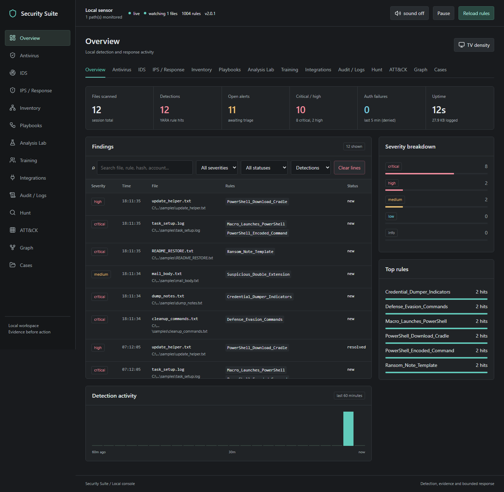
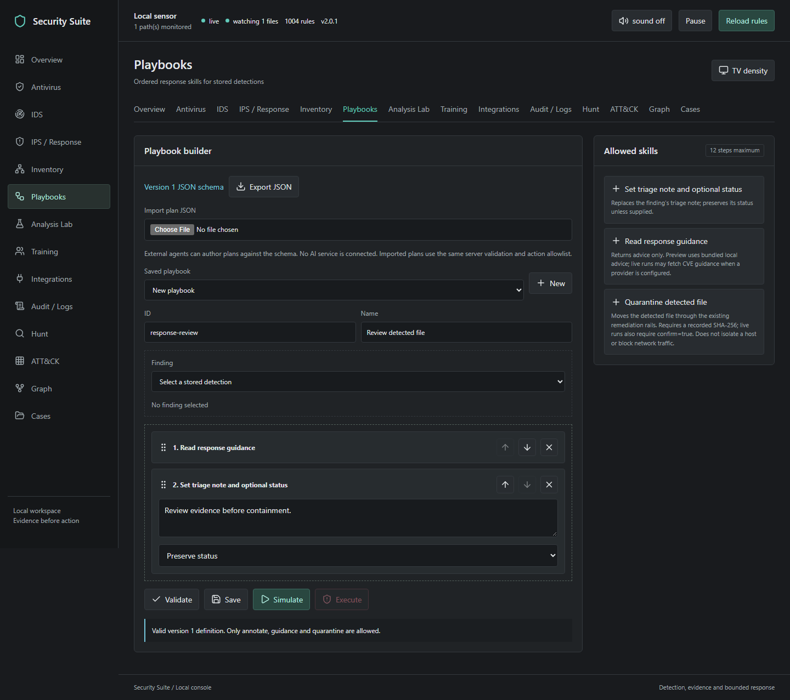

# Security Suite

> ### This is a mirror
>
> The canonical repository is **[security-suite-dashboard](https://github.com/gocar112/security-suite-dashboard)**.
> Open issues and send changes there; anything committed here is overwritten by
> the next sync.
>
> This repo is kept because the project started here as a single file. The
> original `YARA_scanning.py`, `install.sh`, `docker-compose.yml` and manual
> installer are still present alongside the current suite. The suite is now a
> .NET application: build it with `dotnet build` and run `securitysuite`.
>
> _Last synced from 7a446e2 on 2026-10-07._


Current release: **2.0.1**

> **Canonical repository.** This is where the work happens. A read-only mirror
> lives at [`soc-yara-scanner`](https://github.com/gocar112/soc-yara-scanner) —
> the repo this project started in as a single file, which still carries the
> original `YARA_scanning.py` and installers. Refresh it with
> `suite-tools sync-mirror`; anything committed there is overwritten.


<p align="center">
  
</p>

<p align="center">
  <strong>A local SOC signal room for YARA detections, IOC pivots, CVE context, triage, and guarded remediation.</strong>
</p>



Security Suite watches local folders, scans files against **1,004 YARA rules**,
correlates detections with authentication telemetry, extracts indicators,
enriches CVE findings with NVD/CISA context, models AV/IDS/IPS posture, and
streams everything into a live browser dashboard. The tabbed console adds
background drive scans, household device inventory, Suricata alert import,
visual playbooks, a text-analysis lab, and local two-player training.

This is a defensive workbench that supplements installed endpoint protection.
It is not NSA affiliated or certified, and a low alert count does not establish
that a computer or network is safe.

> **Windows x64 only.** The suite is .NET 10 and binds YARA through Microsoft's
> `libyara.NET`, a C++/CLI mixed-mode assembly. This repository targets and tests
> `win-x64`; a mixed-mode image cannot load as AnyCPU. Version 1.x ran on Linux
> and macOS as well; 2.0 does not. The
> scanner sits behind `IScanBackend`, so a P/Invoke or CLI-shelling backend can
> restore those platforms without touching the monitor, the store, the HTTP
> layer or the remediation rails.

## Quick Links

- Operator guide: [book/Security-Suite-Operator-Guide.md](book/Security-Suite-Operator-Guide.md)
- Detection engineering field guide: [book/Detection-Engineering-in-Practice.pdf](book/Detection-Engineering-in-Practice.pdf)
- Database summary: [docs/database-summary.md](docs/database-summary.md)
- C# migration verification: [docs/migration-verification.md](docs/migration-verification.md)
- Release summary: [docs/release-summary.md](docs/release-summary.md)
- Detailed update report: [docs/update-report-1.1.0.md](docs/update-report-1.1.0.md)
- Main dashboard screenshot: [docs/images/console-1440.png](docs/images/console-1440.png)

## At A Glance

| Capability | What it does |
| --- | --- |
| Detect | Scans files with 1,004 YARA rules across malware, web shell, ransomware, credential theft, C2, supply-chain, Linux, Windows, and vulnerable-component namespaces. |
| Correlate | Pulls nearby failed-logon telemetry from the Windows Security event log, falling back to a syslog-format auth log when one is present. Reports which source answered, so `quiet` never looks like `blind`. |
| Pivot | Extracts URLs, domains, IPs, wallets, CVEs, hashes, registry keys, and file paths; dashboard values are defanged. |
| Enrich | Uses NVD, OSV, CISA KEV, and optional VirusTotal hash lookups for context. |
| Shield | Shows local AV, IDS, IPS, Bitdefender-ready, NVD, and CISA KEV defensive layers. |
| Triage | Acknowledge, resolve, mark false positive, reopen, and clear dashboard lines with backup. |
| Remediate | Quarantine, restore, delete, and purge detection targets behind hash checks, path confinement, and an audit trail. |
| Drive scan | Walks a local drive in a background job without a file-count limit; shows progress, skips, errors and cancellation. |
| Inventory | Discovers devices on an explicitly selected RFC1918 IPv4 subnet (/24 through /32), with optional checks of eight service ports. |
| Playbooks | Drag or select skills, attach a stored finding, simulate, save, import/export JSON, and run approved actions. |
| Analysis lab | Matches pasted text against YARA and extracts indicators without executing or storing the text. |
| Training | Offers 500 synthetic defensive scenarios for two people sharing the same browser. These are tabletop questions, not validated exploit tests. |
| ATT&CK | Maps the ruleset to MITRE ATT&CK from rule metadata and renders a tactic matrix, so coverage and gaps are both visible. |
| Hunt | Field query language over stored findings: `severity:critical AND NOT status:resolved`, wildcards, boolean operators, saved hunts. |
| Graph | Clusters findings into campaigns by shared indicators, so six rows that are one intrusion read as one object. |
| Cases | Groups findings under an owner, a status and notes, and exports a self-contained incident report. |

## Quick Start

```powershell
dotnet run --project src/SecuritySuite.Cli
```

Then open:

```text
http://127.0.0.1:8787
```

The server is built on `HttpListener` from the base class library, and the
dashboard is plain HTML/CSS/JS. There is no frontend build step and no web
framework: the only package the suite depends on is the YARA binding.

If the default port is occupied, the launcher tries the next nine ports. It
reuses a running console only when its version *and* its findings log match, so
two instances never interleave writes to the same NDJSON. An explicit `--port`
does not fall back. Use the URL printed by the launcher.

Build a standalone executable:

```powershell
dotnet publish src/SecuritySuite.Cli -c Release
```

That produces `securitysuite.exe`, which is what the desktop shortcut points at.

Recommended verification before release:

```powershell
dotnet build --configuration Release
dotnet test --configuration Release
npm ci
npm run test:js
# Start the suite in another terminal, then:
npx playwright install chromium
$env:SUITE_URL="http://127.0.0.1:8787"
npm run test:ui
dotnet run --project src/SecuritySuite.Tools -- summarize-database --output docs\database-summary.md
```

Browser QA needs Playwright and a running suite. It drives the console at four
viewport widths and checks every view, so it catches the things a unit test
cannot, such as a payload whose shape the dashboard cannot read:

```powershell
npm install
npx playwright install chromium
npm run test:ui
```

Warnings are errors in `Directory.Build.props`, so a clean build also means the
nullable and analyzer rules the code is written against are satisfied.

## Requirements

| Requirement | Status | Needed for |
| --- | --- | --- |
| .NET 10 SDK | Required to build | Everything. The runtime alone is enough to run a published build. |
| `Microsoft.O365.Security.Native.libyara.NET.Core` 4.5.5 | Required | YARA compile and scan engine. Restored by NuGet, and the native libyara ships inside it, so there is nothing to install separately. |
| Windows x64 | Required | The YARA binding is C++/CLI and this repository targets `win-x64`. See the platform note above. |
| Administrator | Optional | Windows Security event-log telemetry. Without it the suite reports `denied` rather than an empty result. |
| Node | Required for release QA | JavaScript syntax checks and the pinned Playwright browser suite. It is not needed to run the published application. |

Nothing here needs a Python interpreter. Version 1.x did; 2.0 is .NET end to end.
TLS uses the Windows certificate store directly, so the CA-bundle workaround that
1.x needed is gone.

## Workspace Tabs

Overview keeps findings, indicator pivots, activity and logs together. Antivirus
contains local-drive selection, scan jobs, and a Windows Security Center product
check. Registered products are reported as registered; that check does not prove
current protection or fresh signatures.

IDS accepts up to 100 Suricata EVE NDJSON records per import. Only alert records
are stored, and imported file paths cannot become remediation targets. IPS /
Response contains the existing guarded containment controls and a persistent
automatic-quarantine toggle. Automatic response requires an eligible matched
rule with `confidence = "high"`, the configured severity threshold, a recorded
hash that still matches, and a permitted root. Generated component rules and
test rules never authorize automatic response. Rule authors should add this
metadata only after tuning against benign samples. Deletion stays manual.

Inventory checks one selected private IPv4 subnet at a time. Devices that block
ping and expose none of the selected TCP ports may be missed; neighbor-cache
entries may be stale. Port labels do not establish device identity or vulnerability.
Run a local scanner on each computer to inspect its files. TVs and IoT devices
can appear in inventory; their firmware is not scanned by this program.

Playbooks accepts only the checked-in [schema](web/playbook.schema.json): annotate,
guidance, and quarantine. Select a finding, build a sequence, and simulate it
before running. External coding agents can generate matching JSON for import;
the server validates every plan. Arbitrary generated scripts are not executed.
Live steps stop on failure, and successful earlier steps are not rolled back.



To use it: choose a stored detection, add skills, fill any annotation, then
Validate and Simulate. Review the results before Execute. Every edit requires
a fresh simulation. Start with guidance and annotation before adding quarantine.

The analysis lab is static text analysis, not a virtual machine or malware
execution sandbox. Training is local pass-and-play; it has no online multiplayer
service. Display density can be increased for a TV, and every tab adapts to
desktop, tablet and narrow screens.

ATT&CK renders the ruleset's technique coverage as a tactic matrix in kill-chain
order. A technique with rules but no detections is coverage; a tactic with no
rules at all is named as a gap rather than drawn as an empty column. The mapping
lives in rule metadata (`mitre = "T1486"` beside `severity`), so rule authors own
it, and the generated vulnerable-component rules are mapped by their file rather
than tagged 931 times.

Hunt is a field query language over stored findings. `severity:critical AND NOT
status:resolved` means what it says, where a substring search for `critical` also
matches a file named `critical_report.txt`. Wildcards, quoting, parentheses and
`-` for NOT all work, adjacency implies AND, and an unknown field is a parse
error naming the real fields rather than a silent empty result. Hunts can be
saved; a saved hunt is parsed before it is stored, so it cannot fail later.

Graph clusters findings that share an indicator into campaigns. Only linking
indicator types merge them, so a shared C2 host means "same operation" while a
shared mention of a CVE does not. Singleton indicators stay in the graph as
pivots.

Cases group findings under an owner, a status and notes. A case references
findings by id and never copies them, so it cannot drift out of date with its
evidence, and it exports as one self-contained HTML incident report with no
external requests and every value escaped.

## OPNsense And DNS Filters

Set `OPNSENSE_URL`, `OPNSENSE_API_KEY`, and `OPNSENSE_API_SECRET` in the local
`.env`. Use an HTTPS private IPv4 origin with a trusted certificate. The
Integrations tab performs a read-only IDS service-status check. A running service
does not verify that IPS drop rules are enabled or that every network interface
is covered. See [OPNsense IDS/IPS setup](https://docs.opnsense.org/manual/ips.html).

The reviewed domain list can be saved and exported for import into a DNS filter.
Saving a list does not block ads or spyware by itself. Use your gateway's DNS
filter settings to enforce a reviewed list; see
[OPNsense Unbound blocklists](https://docs.opnsense.org/manual/unbound.html).
Rules should target malicious behavior and evidence, not country of origin.
The Bitdefender panel reports setup only; the GravityZone control API is not
implemented. Keep your installed antivirus enabled.

## Repository Security

[SECURITY.md](SECURITY.md) documents reporting and deployment boundaries.
Dependabot configuration checks NuGet and Actions dependencies weekly; CodeQL
analyzes C# and JavaScript on pushes, pull requests and its weekly schedule.
CI runs the build, boundary tests, JavaScript checks, database-summary
generation, and rule-load smoke check on Windows. These checks do not certify
malware-detection accuracy or test live household devices.

Administrators should verify dependency graph, Dependabot security alerts,
secret scanning, push protection and private vulnerability reporting under the
repository's Security / Advanced Security settings. Configuration files alone
do not enable those account-level settings. Follow the
[GitHub repository-security quickstart](https://docs.github.com/en/code-security/getting-started/quickstart-for-securing-your-repository).
Keep `.env`, runtime logs, device inventories and quarantine contents out of git.

## How To Use It

### 1. Start The Console

```powershell
securitysuite
```

The console prints the loaded rule count, watched folders, telemetry source, and
whether auto-remediation is armed.

### 2. Drop A Test File

```powershell
copy samples\README_RESTORE.txt uploads\
```

On macOS or Linux:

```bash
cp samples/README_RESTORE.txt uploads/
```

The finding should appear in the dashboard within a few seconds.


### 3. Open The Finding

Click the row to inspect the detection.

The drawer shows:

- Verdict, severity, and trigger.
- File path, SHA-256, size, entropy, and target state.
- Every matched rule and matched string offset.
- CVE, KEV, and patch guidance when available.
- Extracted indicators.
- Triage and remediation actions.


### 4. Pivot Indicators

The indicator panel aggregates observables across all detected files.


Use **Export CSV** when you want to hand the observable set to a SIEM or ticket.

### 5. Use The Shield Fabric

The **Antivirus / IDS / IPS** panel summarizes the defensive stack:

- AV: local YARA scanner, quarantine, hash identity, and guarded delete.
- IDS: finding stream, live alerts, IOC extraction, and auth telemetry.
- IPS: manual containment actions after preview and confirmation.
- Patch: NVD, CISA KEV, vendor advisory links, and remediation playbooks.
- Connector-ready: Bitdefender GravityZone can be bridged later through its
  official HTTPS JSON-RPC API by setting `BITDEFENDER_API_KEY` and
  `BITDEFENDER_API_URL` in `.env`.

The attack pressure library maps **500 defensive attack reasons** to safe
responses. It is for training, triage, and coverage planning; it does not
include exploit steps.

### 6. Remediate Carefully


Use **Quarantine** first when evidence might matter. Use **Delete** only when
the file is confirmed malicious or disposable.

## Remediation Safety

Remediation is the destructive part of the suite. Everything else is read-first.

| Action | Meaning | Reversible? |
| --- | --- | --- |
| `quarantine` | Move the detected file into quarantine with metadata. | Yes |
| `restore` | Move a quarantined file back to its original path. | Usually |
| `delete` | Permanently remove the detected file. | No |
| `purge` | Permanently remove a quarantined copy. | No |

A remediation action proceeds only when the safety rails pass:

1. Target path comes from the stored finding, not from the browser request.
2. SHA-256 is re-checked immediately before action.
3. Resolved path must stay inside permitted roots.
4. Suite-owned paths are refused.
5. Directories are refused unless explicitly allowed.
6. Confirmation is required.
7. Already-handled targets are refused.
8. Attempts and refusals are written to the audit trail.

Auto-remediation is off by default. If enabled, the default action should remain
`quarantine`, not delete.

### Why rail 4 exists

Pointed at this repository, the current ruleset flags **27 of 55 tracked files,
16 of them critical** — including `rules/c2_network.yar` and
`rules/credential_theft.yar`. A rule that hunts for `sekurlsa::logonpasswords`
necessarily contains that string. Without the suite-owned-path rail, an
auto-delete-at-critical run would delete the detector's own ruleset.

An earlier version of that rail listed protected directories instead of
protecting the tree, and a test deleted this README. Enumerating what to protect
produces a list that is never complete.

> **Expect false positives.** 1,004 rules, 931 of them generated and never run
> against your data. One rule in this repo raised *critical* on a reading list
> containing the word *Exodus*. Prefer `quarantine` until a rule has earned your
> trust; `delete` cannot be undone.

## Clear Lines

**Clear lines** resets the active dashboard stream after backing it up.

It clears:

- `data/findings.ndjson`
- `data/triage.json`
- the live dashboard table/feed state

It does not clear:

- watched files
- quarantined files
- YARA rules
- Git history
- secrets or environment variables

Backups are written under:

```text
data/log-backups/
```

## Launcher And Startup

Create a desktop launcher:

```powershell
securitysuite --install-shortcut
```

Start Security Suite automatically when you sign in:

```powershell
securitysuite --install-shortcut --startup
```

Remove either again with `--remove-shortcut`, with `--startup` to pick which one.

Publish first, so the shortcut points somewhere a rebuild will not break:

```powershell
dotnet publish src/SecuritySuite.Cli -c Release -o dist
```

The shortcut points at `dist/securitysuite.exe` and passes `--no-browser`, so
signing in does not open a tab. A shortcut aimed into `bin/` would break on the
next clean, which is why `dist/` exists and is gitignored. Nothing is installed
system-wide and nothing needs elevation: the `.lnk` goes in the per-user Desktop
or Startup folder. Shortcuts are created through the shell's own `IShellLink`
interface, so no child process is spawned to write one.

Run it from the build output before publishing, if you prefer:
`dotnet run --project src/SecuritySuite.Cli -- --install-shortcut`.

## Samples

Each sample is harmless text and is designed to trip one rule.

| Sample | Rule | Severity |
| --- | --- | --- |
| `README_RESTORE.txt` | `Ransom_Note_Template` | critical |
| `cleanup_commands.txt` | `Defense_Evasion_Commands` | critical |
| `dump_notes.txt` | `Credential_Dumper_Indicators` | critical |
| `task_setup.log` | `PowerShell_Encoded_Command` | high |
| `update_helper.txt` | `PowerShell_Download_Cradle` | high |
| `mail_body.txt` | `Suspicious_Double_Extension` | medium |
| `report_q3.txt` | clean scan | none |

## Intelligence And Database

The source lattice separates live adapters from reference links.

| Source | Credential | Purpose |
| --- | --- | --- |
| NVD | Optional | CVE lookup, keyword search, modification-window sync |
| OSV | None | Commit, package, version, and purl vulnerability lookup |
| VirusTotal | Required | Hash reputation; no file upload |
| CISA KEV | None | Known exploited vulnerability context |
| Bitdefender GravityZone | Required for live connector | Connector-ready policy, report, quarantine, sandbox, and network API map |
| GitHub Advisories | None | Reference link |
| Vuls | None | Reference link |
| ClawFire | None | Reference link |

Summarize the local database:

```powershell
suite-tools summarize-database
```

Sync a trailing NVD window while the server is running:

```powershell
Invoke-RestMethod -Method Post -Uri http://127.0.0.1:8787/api/nvd/sync -ContentType "application/json" -Body '{"days":3}'
```

## CLI

```powershell
securitysuite                                     # dashboard + monitor
securitysuite --watch D:\ftp --watch E:\inbox     # replaces the configured paths
securitysuite --port 9000 --no-browser
securitysuite --scan .\uploads                    # scan, print JSON, exit
securitysuite --headless                          # monitor only, no dashboard
securitysuite --scan-existing                     # also scan what is already there
securitysuite --install-shortcut [--startup]
securitysuite --help
```

Diagnostics go to stderr and data to stdout, so `--scan` is pipeable:

```powershell
securitysuite --scan .\uploads > report.json
```

Maintenance commands live in a separate executable, so nobody running a detector
has a repository-mirroring command one typo away:

```powershell
suite-tools generate-rules --limit 1000 --min-score 9 --dry-run
suite-tools summarize-database --output docs\database-summary.md
suite-tools sync-mirror --dry-run
```

## Configuration

Defaults live in
[src/SecuritySuite.Core/Configuration/SuiteConfig.cs](src/SecuritySuite.Core/Configuration/SuiteConfig.cs).
To override them, create `config.json` in the project root. Keys are snake_case,
so a `config.json` written by 1.x still loads unchanged; an unrecognised key is
named at startup rather than ignored silently, and credentials in `config.json`
are refused with a note to move them to `.env`.

```json
{
  "watch_paths": ["uploads"],
  "recursive": true,
  "poll_interval": 2.0,
  "settle_seconds": 1.0,
  "max_file_mb": 64,
  "lookback_minutes": 5,
  "host": "127.0.0.1",
  "port": 8787,
  "auto_remediate": false,
  "auto_remediate_action": "quarantine"
}
```

## API Snapshot

All endpoints are intended for localhost use. The server rejects non-loopback
`Host` headers.

| Method | Endpoint | Purpose |
| --- | --- | --- |
| GET | `/api/state` | Current stats, monitor status, engine info, telemetry, config |
| GET | `/api/findings` | Filtered findings |
| POST | `/api/findings/clear` | Back up and clear active dashboard lines |
| GET | `/api/rules` | Loaded rules and compile errors |
| POST | `/api/rules/reload` | Recompile the YARA ruleset |
| POST | `/api/scan` | Start a background file/directory scan (202; poll `/api/jobs`) |
| GET / POST | `/api/jobs` | Scan progress / start a job |
| POST | `/api/jobs/cancel` | Request cooperative scan cancellation |
| GET | `/api/drives` | List local fixed drives |
| GET / POST | `/api/inventory` | Inventory snapshot / start explicit private-subnet discovery |
| GET | `/api/inventory/export` | Export observed devices as CSV |
| POST | `/api/ids/import` | Import validated Suricata EVE alerts |
| GET | `/api/workspace` | Read response policy, native AV registration and reviewed domains |
| POST | `/api/policy` | Update automatic-quarantine policy |
| POST | `/api/analysis` | Analyze text without execution or persistence |
| GET | `/api/playbooks` | Saved plans and allowed skills |
| POST | `/api/playbooks/save` | Save a schema-validated plan |
| POST | `/api/playbooks/run` | Simulate or execute approved steps on a stored finding |
| GET | `/api/training` | Synthetic defensive scenarios |
| POST | `/api/training/grade` | Grade one tabletop response |
| POST | `/api/monitor` | Pause or resume monitoring |
| POST | `/api/triage` | Acknowledge, resolve, false-positive, or reopen a finding |
| GET | `/api/shield` | AV/IDS/IPS posture, attack-pressure library, and file split groups |
| GET | `/api/iocs` | Extracted indicators, JSON or CSV |
| GET | `/api/remediate` | Remediation status and recent actions |
| GET | `/api/remediate/guidance` | Guidance for a finding |
| POST | `/api/remediate` | Quarantine, restore, delete, or purge one finding |
| POST | `/api/remediate/bulk` | Preview or execute bulk remediation |
| GET | `/api/nvd` | NVD cache status |
| POST | `/api/nvd/sync` | Sync a trailing NVD modification window |
| GET / POST | `/api/osv/query` | OSV lookup |
| GET | `/api/vt/file` | VirusTotal hash reputation |
| GET | `/api/attack/coverage` | ATT&CK matrix: techniques the ruleset covers, and which have fired |
| GET | `/api/attack/techniques` | The embedded technique table and tactic order |
| GET | `/api/hunt` | Run a hunt query (`?q=`); a parse error answers 400 with the reason |
| GET / POST | `/api/hunt/saved` | Saved hunts / save or delete one |
| GET | `/api/graph` | Link graph and campaign clusters |
| GET / POST | `/api/cases` | Case list and summary / open a case |
| GET | `/api/cases/detail` | One case with its linked findings |
| POST | `/api/cases/update` | Change title, owner, summary, status or severity |
| POST | `/api/cases/link` | Attach or detach findings by id |
| POST | `/api/cases/note` | Append a case note |
| POST | `/api/cases/delete` | Delete a case |
| GET | `/api/report` | Self-contained incident report for a case, as a download |
| GET | `/api/instance` | Version and findings log, used to detect a running instance |
| GET | `/api/telemetry` | Recent authentication failures, with the source that answered |
| GET | `/api/intel` | Intelligence source status; never returns a credential |
| GET | `/api/connectors` | OPNsense and Bitdefender configuration state |
| POST | `/api/connectors/check` | One verified read-only OPNsense health request |
| GET | `/api/ids` | Imported IDS alerts |
| GET | `/api/domains/export` | Reviewed domain list as a hosts file |
| POST | `/api/domains` | Save the reviewed domain list |
| POST | `/api/native-av` | Query Windows Security Center for registered products |
| POST | `/api/inventory/cancel` | Cancel a running discovery scan |
| GET | `/api/nvd/cve` | One CVE by id |
| GET | `/api/nvd/cves` | Cached CVEs from the last sync |
| GET | `/api/nvd/search` | Keyword search against NVD |
| GET | `/api/osv` | OSV adapter status |
| GET | `/api/vt` | VirusTotal adapter status and tier |
| GET | `/api/vt/capabilities` | What the configured key may actually reach |
| GET | `/api/vt/livehunt`, `/api/vt/retrohunt` | Hunting, gated; 402 when the tier cannot reach it |
| GET | `/api/stream` | Server-Sent Events stream |

## Project Layout

```text
SecuritySuite.slnx             solution
Directory.Build.props          shared build settings (net10.0-windows, x64, warnings as errors)
config.json                    optional local overrides
src/SecuritySuite.Core/        scanner, store, server, adapters, remediation rails
src/SecuritySuite.Cli/         securitysuite.exe - monitor, dashboard, --scan, shortcuts
src/SecuritySuite.Tools/       suite-tools.exe - rule generation, summaries, mirror sync
tests/SecuritySuite.Tests/     333 tests (xUnit)
dist/                          published build the shortcuts point at (gitignored)
global.json                    pins the SDK to stable .NET 10
package.json                   Playwright browser QA only; the suite needs no npm
rules/                         YARA rules
rules/generated/               generated vulnerable-component rules
samples/                       harmless test files
uploads/                       default watched folder
web/                           dashboard HTML/CSS/JS
web/views.js                   ATT&CK, hunt, graph and cases views
assets/                        app logo and desktop icon
book/                          operator and field-guide documentation
docs/images/                   README screenshots
docs/database-summary.md       generated local database summary
data/findings.ndjson           active finding log
data/triage.json               active triage state
data/remediation.json          remediation audit/state
data/log-backups/              Clear lines backups
data/cases.json                casework sidecar
data/saved-hunts.json          saved hunt queries
data/.monitor.lock             one-monitor-per-workspace lock, held while running
quarantine/                    quarantined files and metadata
nvds/                          local NVD cache
```

## Documentation

Use the README for setup and release checks. Use the operator guide for daily
workflow:

- [Security Suite Operator Guide](book/Security-Suite-Operator-Guide.md)
- [Detection Engineering In Practice PDF](book/Detection-Engineering-in-Practice.pdf)
- [Detection Engineering In Practice DOCX](book/Detection-Engineering-in-Practice.docx)

## Security Notes

- Keep the console on loopback; this release rejects non-local bind addresses.
- Run as Administrator on Windows only if you need Security event-log telemetry.
- Never paste API keys, GitHub tokens, passwords, or private keys into commits,
  issues, README files, or chat.
- This client never uploads files to VirusTotal. Hash reputation is lookup-only.
- Remediation is manual by default. Leave auto-remediation off until rules are
  tested against your own data, and note that the auto-rule can only ever
  quarantine: an unattended delete is refused however it is configured.
- The dashboard has no CSRF token. It relies on loopback binding, a `Host`
  header check, and requiring `Content-Type: application/json` on every write,
  which forces a preflight this server never answers.
- Only one monitor may run per workspace. A lock file beside the findings log
  enforces it, so a second instance started on a different port is refused
  rather than sweeping the same paths and writing duplicate findings.
- `suite-tools sync-mirror` exports with `git archive HEAD`, so only committed,
  tracked files can reach the mirror. An uncommitted `.env`, a cache directory
  or a quarantined file cannot leak through it.

## What Changed In 2.0

Version 2.0 is a full rewrite from Python to C#. Behaviour is preserved except
where noted; these are the differences worth knowing about.

| Area | 1.x (Python) | 2.0 (C#) |
| --- | --- | --- |
| Platform | Windows, Linux, macOS | **Windows x64 only** — the repository targets and tests `win-x64` because of the C++/CLI YARA binding |
| Runtime | Python 3.10+, `yara-python`, `certifi`, `pywin32` | .NET 10, one NuGet package |
| Scan timeout | `timeout=60` per scan | **Not available** — `libyara.NET` exposes only `ScanFlags.None/Fast`, so exposure is bounded by `max_file_mb` instead |
| Rule metadata | Parsed out of rule source text, because yara-python has no introspection | Real introspection via `Rules.GetRules()` |
| Match attribution | YARA namespaces, one per rule file | A rule-name to file map built while each file is validated. Same answer, different route — `libyara.NET` has no namespace parameter |
| Telemetry on Windows | Backwards scan of up to 4,000 event records, needed optional `pywin32` | `EventLogQuery` with an XPath filter, so the log engine does the filtering; no optional dependency |
| Host discovery | Shelled out to `ping`, then re-parsed its output because Windows exits 0 for a destination-unreachable reply | `System.Net.NetworkInformation.Ping`, where `IPStatus` is unambiguous |
| IOC CSV export | Header and value lists written out twice, so a new field silently failed to export | Columns derived from the model |
| NVD status | Cached sync index merged into the live payload, which let a stale `api_key: false` report a configured key as absent | Sync index nested under `sync`, making that class of bug impossible |
| Playbook validation | Hand-written JSON Schema validator | Typed model with `JsonUnmappedMemberHandling.Disallow`; `web/playbook.schema.json` remains the contract |
| Tests | 55 | 333 |

## What Changed From `YARA_scanning.py`

| Original | Security Suite |
| --- | --- |
| One directory, non-recursive scan loop | Recursive watcher with settle checks |
| Rule compile failure could hide behind fallback behavior | Compile errors are surfaced by rule file |
| Rule matches were just names | Full rule metadata, strings, offsets, severity, and namespace |
| No file identity | SHA-256, size, mtime, entropy, and target state |
| Own logs could be rescanned | Suite output and protected paths are excluded |
| No pause or reload | Pause/resume monitor and hot-reload rules |
| Print/log output | Live dashboard, triage workflow, IOC panel, JSON API |
| Detection only | Guarded quarantine, restore, delete, purge, and clear lines |
