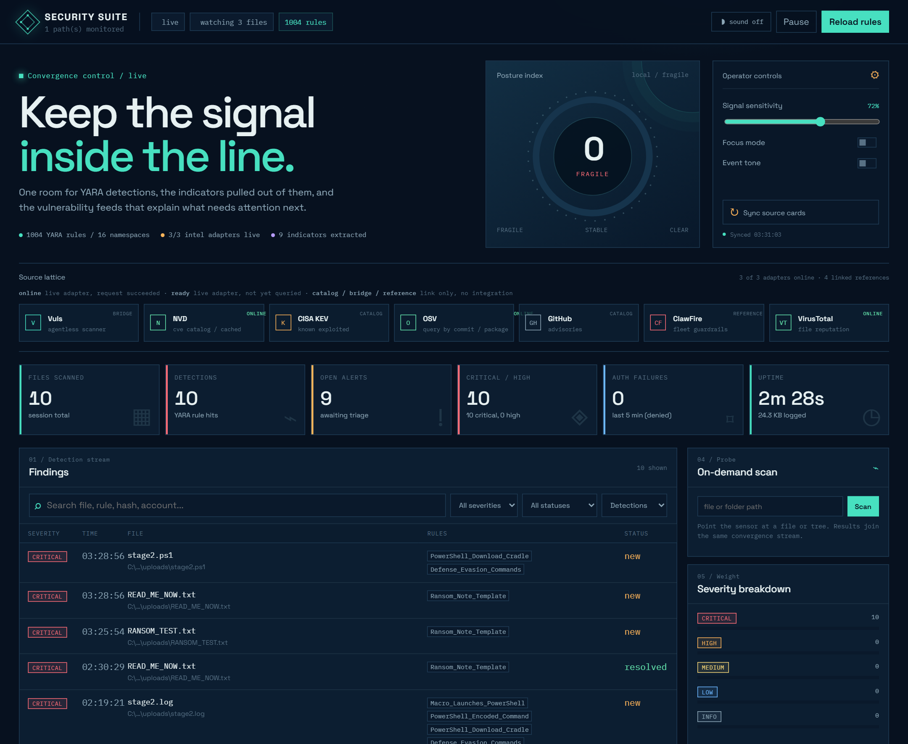
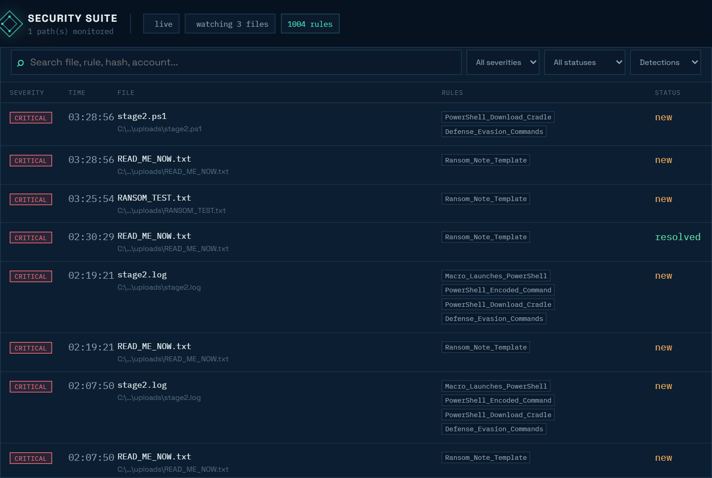
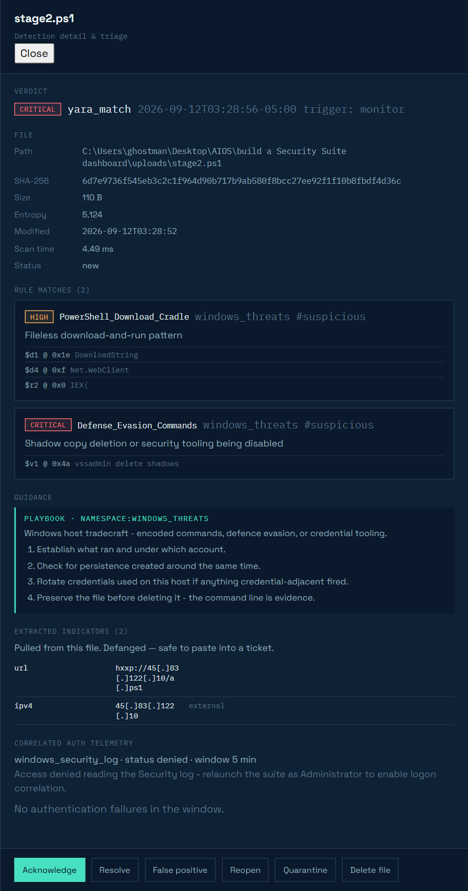
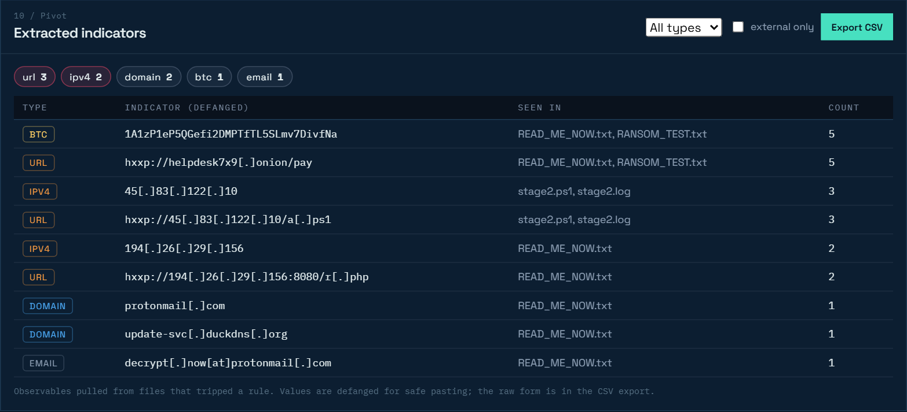
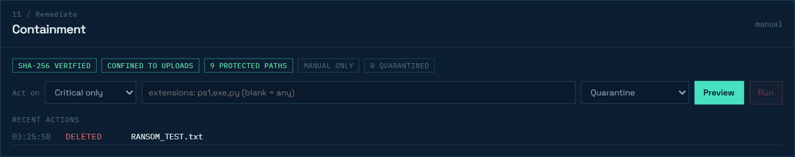

# Security Suite

> **About this repository.** This is the original SOC YARA scanner repo. The
> single-file `YARA_scanning.py` it started as is still here, alongside the
> original `install.sh`, `docker-compose.yml` and manual installer. Everything
> else is the suite that grew out of it, mirrored from
> [`security-suite-dashboard`](https://github.com/gocar112/security-suite-dashboard).
> `YARA_scanning.py` is kept for history; `run.py` is what you run.


<p align="center">
  
</p>

<p align="center">
  <strong>A local SOC signal room for YARA detections, IOC pivots, CVE context, triage, and guarded remediation.</strong>
</p>



Security Suite watches local folders, scans files against **1,004 YARA rules**,
correlates detections with authentication telemetry, extracts indicators,
enriches CVE findings with NVD/CISA context, and streams everything into a live
browser dashboard.

## Quick Links

- Operator guide: [book/Security-Suite-Operator-Guide.md](book/Security-Suite-Operator-Guide.md)
- Detection engineering field guide: [book/Detection-Engineering-in-Practice.pdf](book/Detection-Engineering-in-Practice.pdf)
- Database summary: [docs/database-summary.md](docs/database-summary.md)
- Main dashboard screenshot: [docs/images/dashboard.png](docs/images/dashboard.png)

## At A Glance

| Capability | What it does |
| --- | --- |
| Detect | Scans files with 1,004 YARA rules across malware, web shell, ransomware, credential theft, C2, supply-chain, Linux, Windows, and vulnerable-component namespaces. |
| Correlate | Pulls nearby failed-logon telemetry from Windows Security log, macOS unified log, Linux auth logs, or journald. |
| Pivot | Extracts URLs, domains, IPs, wallets, CVEs, hashes, registry keys, and file paths; dashboard values are defanged. |
| Enrich | Uses NVD, OSV, CISA KEV, and optional VirusTotal hash lookups for context. |
| Triage | Acknowledge, resolve, mark false positive, reopen, and clear dashboard lines with backup. |
| Remediate | Quarantine, restore, delete, and purge detection targets behind hash checks, path confinement, and an audit trail. |

## Quick Start

```powershell
python run.py
```

Then open:

```text
http://127.0.0.1:8787
```

The server is built on Python's standard `http.server`, and the dashboard is
plain HTML/CSS/JS. There is no frontend build step.

Fresh machine setup:

```powershell
pip install -r requirements.txt
python run.py
```

Recommended verification before release:

```powershell
python -m compileall securitysuite tools
node --check web\app.js
python tools\summarize_database.py
```

## Requirements

| Package | Status | Needed for |
| --- | --- | --- |
| `yara-python` | Required | YARA compile and scan engine |
| `certifi` | Recommended | Current CA bundle for NVD TLS requests |
| `pywin32` | Optional, Windows only | Windows Security event-log telemetry |

Python 3.10 or newer is recommended.

## How To Use It

### 1. Start The Console

```powershell
python run.py
```

The console prints the loaded rule count, watched folders, telemetry source, and
whether auto-remediation is armed.

### 2. Drop A Test File

```powershell
copy samples\README_RESTORE.txt uploads\
```

On macOS or Linux:

```bash
cp samples/README_RESTORE.txt uploads/
```

The finding should appear in the dashboard within a few seconds.



### 3. Open The Finding

Click the row to inspect the detection.

The drawer shows:

- Verdict, severity, and trigger.
- File path, SHA-256, size, entropy, and target state.
- Every matched rule and matched string offset.
- CVE, KEV, and patch guidance when available.
- Extracted indicators.
- Triage and remediation actions.



### 4. Pivot Indicators

The indicator panel aggregates observables across all detected files.



Use **Export CSV** when you want to hand the observable set to a SIEM or ticket.

### 5. Remediate Carefully



Use **Quarantine** first when evidence might matter. Use **Delete** only when
the file is confirmed malicious or disposable.

## Remediation Safety

Remediation is the destructive part of the suite. Everything else is read-first.

| Action | Meaning | Reversible? |
| --- | --- | --- |
| `quarantine` | Move the detected file into quarantine with metadata. | Yes |
| `restore` | Move a quarantined file back to its original path. | Usually |
| `delete` | Permanently remove the detected file. | No |
| `purge` | Permanently remove a quarantined copy. | No |

A remediation action proceeds only when the safety rails pass:

1. Target path comes from the stored finding, not from the browser request.
2. SHA-256 is re-checked immediately before action.
3. Resolved path must stay inside permitted roots.
4. Suite-owned paths are refused.
5. Directories are refused unless explicitly allowed.
6. Confirmation is required.
7. Already-handled targets are refused.
8. Attempts and refusals are written to the audit trail.

Auto-remediation is off by default. If enabled, the default action should remain
`quarantine`, not delete.

### Why rail 4 exists

Pointed at this repository, the current ruleset flags **27 of 55 tracked files,
16 of them critical** — including `rules/c2_network.yar` and
`rules/credential_theft.yar`. A rule that hunts for `sekurlsa::logonpasswords`
necessarily contains that string. Without the suite-owned-path rail, an
auto-delete-at-critical run would delete the detector's own ruleset.

An earlier version of that rail listed protected directories instead of
protecting the tree, and a test deleted this README. Enumerating what to protect
produces a list that is never complete.

> **Expect false positives.** 1,004 rules, 931 of them generated and never run
> against your data. One rule in this repo raised *critical* on a reading list
> containing the word *Exodus*. Prefer `quarantine` until a rule has earned your
> trust; `delete` cannot be undone.

## Clear Lines

**Clear lines** resets the active dashboard stream after backing it up.

It clears:

- `data/findings.ndjson`
- `data/triage.json`
- the live dashboard table/feed state

It does not clear:

- watched files
- quarantined files
- YARA rules
- Git history
- secrets or environment variables

Backups are written under:

```text
data/log-backups/
```

## Samples

Each sample is harmless text and is designed to trip one rule.

| Sample | Rule | Severity |
| --- | --- | --- |
| `README_RESTORE.txt` | `Ransom_Note_Template` | critical |
| `cleanup_commands.txt` | `Defense_Evasion_Commands` | critical |
| `dump_notes.txt` | `Credential_Dumper_Indicators` | critical |
| `task_setup.log` | `PowerShell_Encoded_Command` | high |
| `update_helper.txt` | `PowerShell_Download_Cradle` | high |
| `mail_body.txt` | `Suspicious_Double_Extension` | medium |
| `report_q3.txt` | clean scan | none |

## Intelligence And Database

The source lattice separates live adapters from reference links.

| Source | Credential | Purpose |
| --- | --- | --- |
| NVD | Optional | CVE lookup, keyword search, modification-window sync |
| OSV | None | Commit, package, version, and purl vulnerability lookup |
| VirusTotal | Required | Hash reputation; no file upload |
| CISA KEV | None | Known exploited vulnerability context |
| GitHub Advisories | None | Reference link |
| Vuls | None | Reference link |
| ClawFire | None | Reference link |

Summarize the local database:

```powershell
python tools\summarize_database.py
```

Sync a trailing NVD window while the server is running:

```powershell
Invoke-RestMethod -Method Post -Uri http://127.0.0.1:8787/api/nvd/sync -ContentType "application/json" -Body '{"days":3}'
```

## CLI

```powershell
python run.py
python run.py --watch D:\ftp --watch E:\inbox
python run.py --port 9000 --no-browser
python run.py --scan .\uploads
python run.py --headless
python run.py --scan-existing
```

## Configuration

Defaults live in [securitysuite/config.py](securitysuite/config.py). To override
them, create `config.json` in the project root.

```json
{
  "watch_paths": ["uploads"],
  "recursive": true,
  "poll_interval": 2.0,
  "settle_seconds": 1.0,
  "max_file_mb": 64,
  "lookback_minutes": 5,
  "host": "127.0.0.1",
  "port": 8787,
  "auto_remediate": false,
  "auto_remediate_action": "quarantine"
}
```

## API Snapshot

All endpoints are intended for localhost use. The server rejects non-loopback
`Host` headers.

| Method | Endpoint | Purpose |
| --- | --- | --- |
| GET | `/api/state` | Current stats, monitor status, engine info, telemetry, config |
| GET | `/api/findings` | Filtered findings |
| POST | `/api/findings/clear` | Back up and clear active dashboard lines |
| GET | `/api/rules` | Loaded rules and compile errors |
| POST | `/api/rules/reload` | Recompile the YARA ruleset |
| POST | `/api/scan` | Scan a file or directory |
| POST | `/api/monitor` | Pause or resume monitoring |
| POST | `/api/triage` | Acknowledge, resolve, false-positive, or reopen a finding |
| GET | `/api/iocs` | Extracted indicators, JSON or CSV |
| GET | `/api/remediate` | Remediation status and recent actions |
| GET | `/api/remediate/guidance` | Guidance for a finding |
| POST | `/api/remediate` | Quarantine, restore, delete, or purge one finding |
| POST | `/api/remediate/bulk` | Preview or execute bulk remediation |
| GET | `/api/nvd` | NVD cache status |
| POST | `/api/nvd/sync` | Sync a trailing NVD modification window |
| GET / POST | `/api/osv/query` | OSV lookup |
| GET | `/api/vt/file` | VirusTotal hash reputation |
| GET | `/api/stream` | Server-Sent Events stream |

## Project Layout

```text
run.py                         launcher
config.json                    optional local overrides
securitysuite/                 scanner, store, server, APIs
rules/                         YARA rules
rules/generated/               generated vulnerable-component rules
samples/                       harmless test files
uploads/                       default watched folder
web/                           dashboard HTML/CSS/JS
assets/                        app logo and desktop icon
book/                          operator and field-guide documentation
docs/images/                   README screenshots
docs/database-summary.md       generated local database summary
data/findings.ndjson           active finding log
data/triage.json               active triage state
data/remediation.json          remediation audit/state
data/log-backups/              Clear lines backups
quarantine/                    quarantined files and metadata
nvds/                          local NVD cache
```

## Documentation

Use the README for setup and release checks. Use the operator guide for daily
workflow:

- [Security Suite Operator Guide](book/Security-Suite-Operator-Guide.md)
- [Detection Engineering In Practice PDF](book/Detection-Engineering-in-Practice.pdf)
- [Detection Engineering In Practice DOCX](book/Detection-Engineering-in-Practice.docx)

## Security Notes

- Keep the server bound to `127.0.0.1` unless you add authentication.
- Run as Administrator on Windows only if you need Security event-log telemetry.
- Never paste API keys, GitHub tokens, passwords, or private keys into commits,
  issues, README files, or chat.
- This client never uploads files to VirusTotal. Hash reputation is lookup-only.
- Remediation is manual by default. Leave auto-remediation off until rules are
  tested against your own data.

## What Changed From `YARA_scanning.py`

| Original | Security Suite |
| --- | --- |
| One directory, non-recursive scan loop | Recursive watcher with settle checks |
| Rule compile failure could hide behind fallback behavior | Compile errors are surfaced by rule file |
| Rule matches were just names | Full rule metadata, strings, offsets, severity, and namespace |
| No file identity | SHA-256, size, mtime, entropy, and target state |
| Own logs could be rescanned | Suite output and protected paths are excluded |
| No pause or reload | Pause/resume monitor and hot-reload rules |
| Print/log output | Live dashboard, triage workflow, IOC panel, JSON API |
| Detection only | Guarded quarantine, restore, delete, purge, and clear lines |
